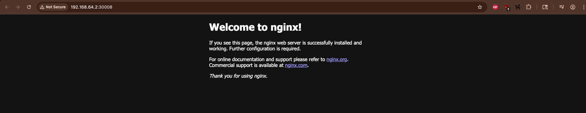

# Kubernetes Work

This repository documents my journey as I master Kubernetes hands-on through labs, YAML configurations, and eventually a full-scale project.

## 📘 Courses Followed

- ✅ Kubernetes for Beginners (KodeKloud)
- ⏳ CKA Certification Path (KodeKloud – in progress)

## 🧠 Concepts Covered
- [x] Containers
- [x] Container Orchestration
- [x] Kubernetes Architecture
- [x] Pods and YAML manifests
- [x] ReplicaSets and scaling
- [x] Label selectors and matching
- [x] Deployments and Rollbacks
- [x] Networking Basics
- [x] Services and Networking
- [ ] Volumes and Persistent Storage
- [ ] Namespaces
- [ ] Multi-node setup with kubeadm

## 📁 Folder Structure

- `pods/` — Basic pod definitions
- `replicasets/` — ReplicaSet and scaling logic
- `deployments/` — Deployments, rollbacks and upgrades
- `services/` — Networking, types of services like node port, clusterIP, and LoadBalancers and how to configure them
    -  Default nginx webpage with ports configured
## 🚀 Next Steps

- Continue with KodeKloud CKA Labs
- Launch full local cluster for offline LLM + Wikipedia project
- Share journey on LinkedIn + Dev.to
